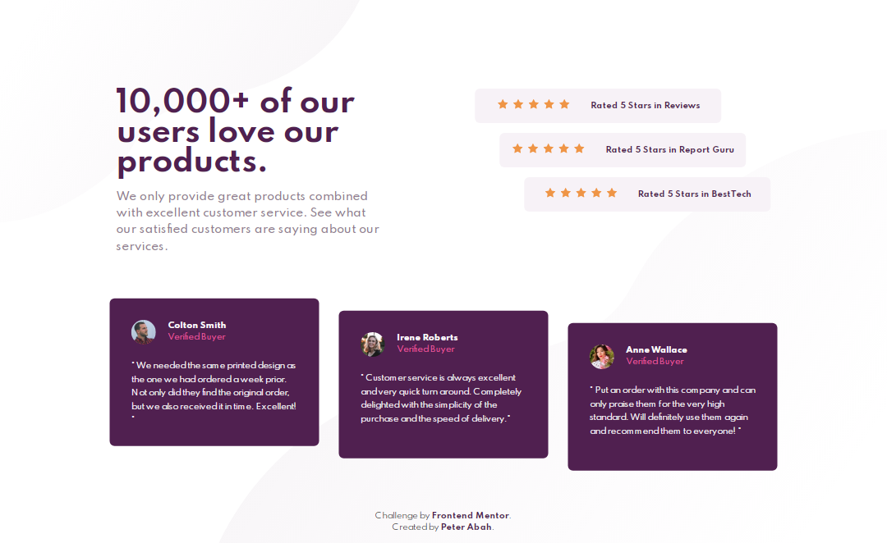
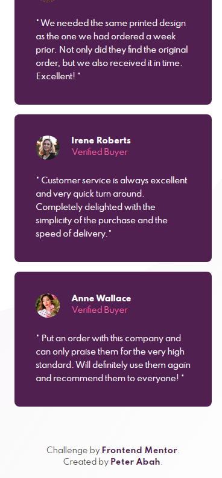

# Frontend Mentor - Social proof section solution

This is a solution to the [Social proof section challenge on Frontend Mentor](https://www.frontendmentor.io/challenges/social-proof-section-6e0qTv_bA).

## Table of contents

- [Overview](#overview)
  - [The challenge](#the-challenge)
  - [Screenshot](#screenshot)
  - [Links](#links)
- [My process](#my-process)
- [Author](#author)

## Overview

### The challenge

The challenge was to replicate to design as accurate as possible and also make the site responsive

### Screenshot
# Desktop

# Mobile

### Links

- Solution URL: [Solution](https://your-solution-url.com)
- Live Site URL: [Live site](https://peter-abah.github.io/social-proof-section)

## My process

I used a mobile first approach in this challenge, although I had issues trying to style the page for tablets since there was no design for tablet sized devices.

## Author
- Twitter - [@iamabah1](https://www.twitter.com/iamabah1)
- Frontend Mentor - [@peter-abah](https://www.frontendmentor.io/profile/peter-abah)